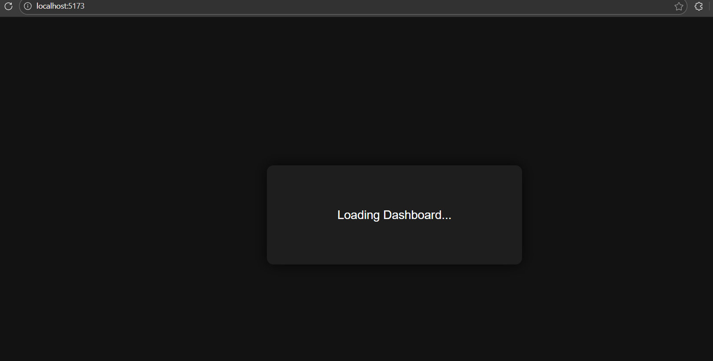

---

# Experiment 5.1: Component-Based Lazy Loading

##  Aim
To optimize frontend performance by implementing lazy loading of components using `React.lazy()` and `Suspense`.

---

## Theory
Lazy loading is a technique where components are loaded only when required.  
`React.lazy()` helps load components dynamically and `Suspense` shows fallback UI during loading.

---

## Implementation
- Only **Dashboard component** is lazy loaded
- Uses `React.lazy()` and `Suspense`
- Artificial delay added to visualize loading

---

## Output Screenshots

### 🔹 Loading State

### 🔹 Dashboard Loaded

---

# Experiment 5.2: Route-Based Lazy Loading

## Aim
To implement route-based lazy loading in a Single Page Application.

---

## Theory
Route-based lazy loading ensures that components are loaded only when a specific route is accessed.  
This reduces initial load time and improves performance.

---

## Implementation
- Used **React Router DOM**
- Lazy loaded:
  - Profile component
  - Dashboard component
- `Suspense` fallback shown inside content box

---

## Output Screenshots

### 🔹 Loading Dashboard

### 🔹 Dashboard Page

### 🔹 Loading Profile

### 🔹 Profile Page

---

# Technologies Used

- React (Vite)
- JavaScript
- React Router DOM
- CSS

